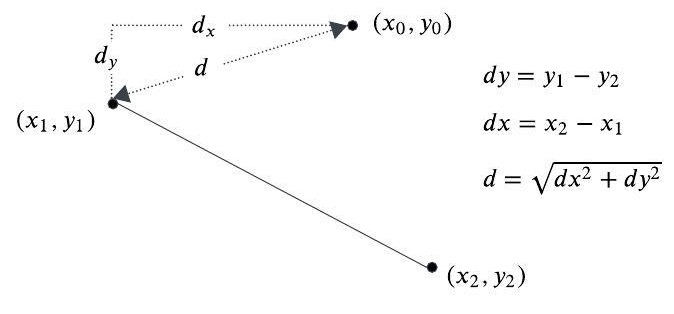
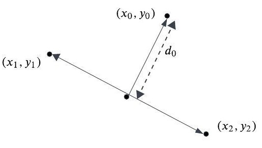
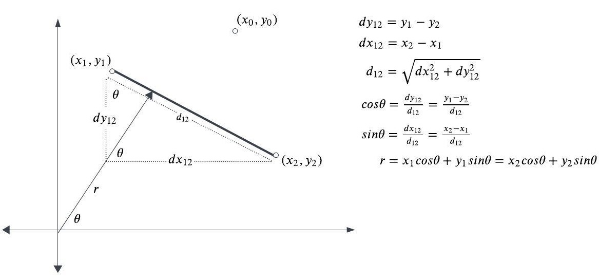
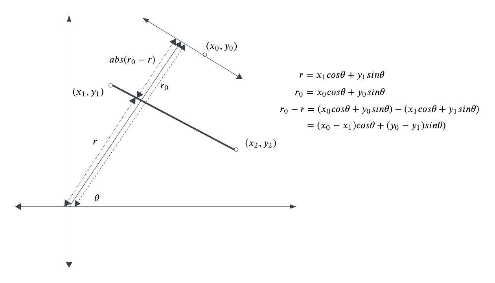
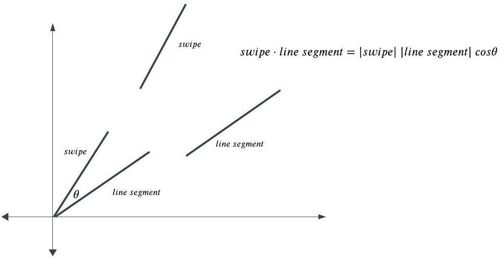

# Graph geometry

A number of geometric calculations are required to support the above specification.

### Determining the distance from a tap to a node
To select a node, detecting whether the distance`d`between
a tap and node.is sufficiently close.
This is the Euclidean distance from a tap to an endpoint of an edge.

### Determining the distance from a tap to an edge
To select an edge, detecting whether the the normal 
distance`d0`between a tap and the line segment of an edge`(x1, y1)`to`(x2, y2)` is sufficiently close.

Calculating the distance in Cartesian coordinates involves
specially treating the case where the line segment is horizontal,
as seen in a moment.
Therefore, this calculation is done in Polar coordinates.

This calculate the Polar equation for the edge line segment.
The polar equation is:

`r = x * cos(theta) + y * sin(theta)`

For the line segment`(x1, y1)`to`(x2, y2)`, 
`cos(theta)`and`sin(theta)` are calculated as below.
`r` is calculated from either endpoint as in the last equation:

`r = x1 * cos(theta) + y1 * sin(theta) = x2 * cos(theta) + y2 * sin(theta)`

The Polar equation for a line parallel to the line segment through
point`(x0, y0)`is:

`r = x0 * cos(theta) + y0 * sin(theta)`

The distance from the point`(x0, y0)`to the line segment is then
the absolute value of the difference between`r0`for
for the line parallel to the line segment through`(x0, y0)`and`r`.

Strictly, this also includes a calculation that`(x0, y0)`lies
between the endpoints`(x1, y1)`and`(x2, y2)`, omitted here
for brevity (projecting`(x0, y0)`,`(x1, y1)` and`(x2, y2)` onto
a line normal to the polar line and verifying the projection of `(x0, y0)`lies 
between the projections of`(x1, y1)`and`(x2, y2)`).

### Determining whether a swipe is parallel to an edge

Determining whether a swipe is parallel to an edge
is found by taking the dot product between the swipe and each edge
and verifying that the`cos(theta)`closest to`1.0` is sufficiently parallel.

